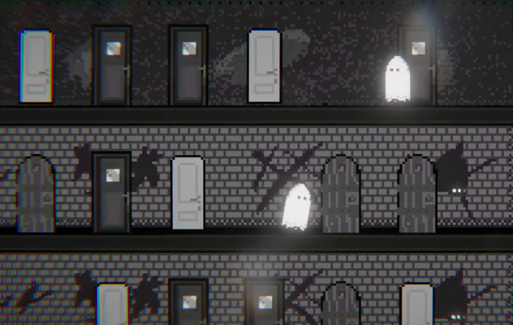

# bit-festival-gamejam-2024
Repository for BIT Festival's 2024 GameJam project.

### Game 

In this game, you take control of one of two ghosts competing in a race to the top of a mysterious tower.
To progress, you must pass through doors — but here’s the catch: you don’t know which ones will lead upward, which will keep you on the same floor, or worse, send you downward.
As the leading player, you’ll need to rely on your instincts and make bold guesses, while the trailing player has the advantage of copying your successful choices, but only as long as they remain in second place.
However, since the doors can work against you, it’s crucial to remember which ones lead upward. Otherwise, you might waste time testing doors on the same floor again!

And one more challenge: the doors sometimes move...